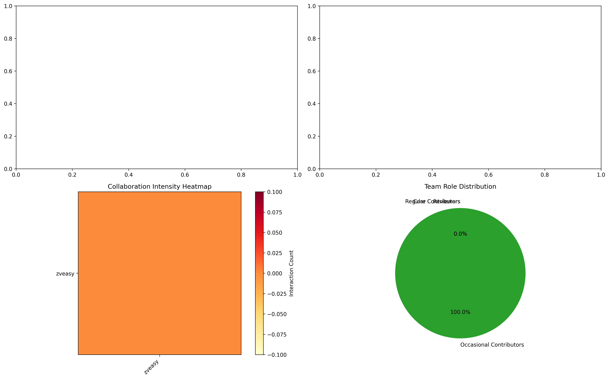

# GitHub Repository Contribution Analysis Report
        
        ## Executive Summary
        
        **Repository:** zveasy/Veasy-SQA2025-AUBURN  
        **Analysis Period:** 2025-04 to 2025-05  
        **Total Contributors:** 1  
        **Total Contributions:** 2  
        
        ### Key Findings
        - **Most Significant Contributor:** zveasy with 100.00% of total contributions (2 contributions)
        - **Least Significant Contributor:** zveasy with 100.00% of total contributions (2 contributions)
        - **Most Active Period:** 2025-05 with 1 contributions
        - **Primary Development Focus:** Other development (2 commits)
        
        ## Contributors Overview
        
        ### All Contributors
        1. **zveasy** - 2 contributions

        ## Repository Information
        
        | Metric | Value |
        |--------|-------|
        | Description | Project |
        | Stars | 0 |
        | Forks | 0 |
        | Open Issues | 0 |
        | Created Date | 2025-04-24T02:44:40Z |
        | Last Updated | 2025-05-09T03:19:42Z |
        | Primary Language | Python |
        | License | N/A |
        
        ## Contribution Rankings
        
        ### Top 10 Contributors
        
        | Rank | Contributor | Total Contributions | Percentage | Commits | Significant Commits | Avg Commit Size | PRs | Issues | Reviews | Comments |
        |------|------------|-------------------|------------|---------|--------------------|--------------------|-----|--------|---------|----------|
        | 1 | zveasy | 2 | 100.00% | 2 | 0 | 2340.5 | 0 | 0 | 0 | 0 |

## Detailed Contributor Analysis

        ### zveasy
        
        #### Contribution Breakdown
        - **Total Contributions:** 2
        - **Contribution Percentage:** 100.00%
        - **Significant Commits:** 0
        - **Average Commit Size:** 2340.5 lines
        
        #### Commit Categories
        | Category | Count | Percentage |
        |----------|-------|------------|
        | Other | 2 | 100.0% |

#### File Types Modified
- `.py`: 13 changes
- `.yml`: 6 changes
- `.pyc`: 6 changes
- `.md`: 5 changes
- `.unknown`: 1 changes

#### Significant Commits
*No significant commits recorded*

#### Key Problems Solved
No significant problems solved recorded.

    ## Temporal Analysis
    
    ### Activity Timeline
    
    
    ### Monthly Activity Summary
    | Month | Total Contributions | Top Contributor |
    |-------|-------------------|----------------|
    | 2025-04 | 1 | zveasy |
| 2025-05 | 1 | zveasy |

    ### Activity Heatmap
    
    
    ## Contribution Type Analysis
    
    ### Overall Distribution
    
    
    ### Contribution Type Breakdown
    | Type | Count | Percentage |
    |------|-------|------------|
    | Commits | 2 | 100.0% |
| Pull Requests | 0 | 0.0% |
| Issues | 0 | 0.0% |
| Reviews | 0 | 0.0% |
| Comments | 0 | 0.0% |

    ## Development Focus Analysis
    
    ### Commit Categories Distribution
    
    
    ### File Type Modification Patterns
    
    
    ### Most Modified File Types by Contributor
    | File Type | Total Modifications | zveasy (Count) | zveasy (%) | 
|-----------|---------------------|---------------|------------|
| `.py` | 13 | 13 | 100.0% | 
| `.yml` | 6 | 6 | 100.0% | 
| `.pyc` | 6 | 6 | 100.0% | 
| `.md` | 5 | 5 | 100.0% | 
| `.unknown` | 1 | 1 | 100.0% | 
| `.csv` | 1 | 1 | 100.0% | 
| `.txt` | 1 | 1 | 100.0% | 

### File Type Modification Summary

| Contributor | Total File Modifications | Percentage of All Modifications |
|------------|-------------------------|--------------------------------|
| zveasy | 33 | 100.0% |

    ## Unknown File Types Analysis
    
    This section provides detailed information about files without standard extensions that were modified in the repository.
    
    ### Unknown Files Overview
    
    **Total Unknown Files:** 1

### Unknown File Categories

| Category | Count | Percentage |
|----------|-------|------------|
| Docker | 1 | 100.0% |

### Most Common Unknown Files

| Filename | Count | Contributors |
|----------|-------|-------------|
| `Dockerfile` | 1 | zveasy |

### Unknown Files by Contributor

#### zveasy (1 unknown files)

**Categories:**

| Category | Count |
|----------|-------|
| Docker | 1 |

**Files:**

| Filename | Count |
|----------|-------|
| `Dockerfile` | 1 |

### Files Modified by Contributor

#### zveasy

**`.py` files (13 files):**
- `TEST_CONSTANTS.py`
- `TEST_GRAPH.py`
- `TEST_INTEGRATION.py`
- `TEST_PARSING.py`
- `TEST_SCANNING.py`
- `constants.py`
- `fuzz.py`
- `graphtaint.py`
- `main.py`
- `parser.py`
- `scanner.py`
- `vault4paper.py`
- `vault4paper_antidot.py`

**`.yml` files (6 files):**
- `Ansible/sample.yml`
- `TEST_ARTIFACTS/empty.yml`
- `TEST_ARTIFACTS/list.k8s.yml`
- `TEST_ARTIFACTS/reso.app.yml`
- `TEST_ARTIFACTS/tasks.main.yml`
- `environment.yml`

**`.pyc` files (6 files):**
- `__pycache__/constants.cpython-312.pyc`
- `__pycache__/graphtaint.cpython-312.pyc`
- `__pycache__/main.cpython-312.pyc`
- `__pycache__/parser.cpython-312.pyc`
- `__pycache__/scanner.cpython-312.pyc`
- `__pycache__/vault4paper_antidot.cpython-312.pyc`

**`.md` files (4 files):**
- `BAD.BOYS.md`
- `NOTES.md`
- `README.md`
- `REPO.md`

**`.unknown` files (1 files):**
- `Dockerfile`

**`.csv` files (1 files):**
- `bandit_report.csv`

**`.txt` files (1 files):**
- `requirements.txt`

    ## Project Evolution
    
    ### Development Trends
    Not enough data to determine development phases.

    ## Team Dynamics Analysis
    
    ### Collaboration Network
    
    
    The collaboration network shows how contributors interact with each other through code reviews, 
    comments, and pull requests. Larger nodes indicate more total contributions, while edge thickness 
    represents the strength of collaboration between contributors.
    
    ### Team Communication Patterns
    
    
    This analysis shows:
    - Average response times for each contributor
    - Mentorship relationships within the team
    - Collaboration intensity between team members
    - Distribution of team roles
    
    ### Mentorship Relationships
    No clear mentorship patterns identified.

### Communication Metrics
No clear Communication Patterns identified.

    ## Technical Debt Analysis
    
    ### Code Quality Indicators
    - **Refactoring commits:** 0.0% of total
    - **Bug fix commits:** 0.0% of total
    - **Documentation updates:** 0.0% of commits
    
    ## Conclusion
    
    The zveasy/Veasy-SQA2025-AUBURN repository shows low activity with 1 contributors and 2 total contributions. The development is dominated by a single contributor, with zveasy leading the contributions at 100.0% of total activity.
    
    ---
    *Report generated on 2025-05-08 22:35:58 using GitHub Repository Contribution Analyzer*
    *Analysis covers contributions from 2025-04 to 2025-05*
    
    ## Notes
    
    - .yaml files have been excluded from this analysis to avoid counting bulk template contributions.
    - .yml files are still included as they typically contain important configuration data.
    - Only actual code and non-.yaml configuration file modifications are tracked.
    
    